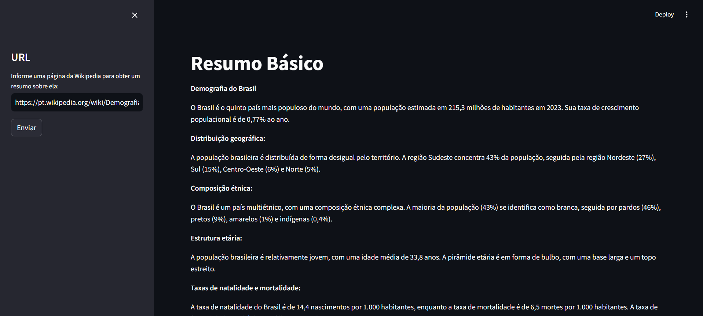

# Gerador de Resumos

Este projeto é uma aplicação web desenvolvida para gerar resumos de páginas da Wikipedia, através do Langchain e utilizando o modelo de linguagem Google Generative AI, especificamente a versão "gemini-pro". A interface do usuário é construída usando o Streamlit, proporcionando uma experiência interativa.

## Motivação 
A motivação por trás deste projeto é aprofundar o entendimento e habilidades nos fundamentos do framework Langchain.
Este projeto representa, portanto, além de uma oportunidade para aprender na prática  sobre o Langchain e suas aplicações, fornecer uma utilidade prática aos usuários finais.

## Funcionalidades


- **Entrada do Usuário:** Permite ao usuário inserir uma URL de uma página da Wikipedia para a qual deseja obter um resumo.
- **Geração de Resumo:** Utiliza o modelo de linguagem para gerar um resumo do conteúdo da página fornecida.
- **Interface:** Uma interface web simples desenvolvida com Streamlit.

## Exemplo de Uso


## Instruções de Uso

1. **Pré-requisitos:** Certifique-se de ter o Python instalado em sua máquina.

2. **Criação do Ambiente Virtual e Instalação das Dependências:**
   - Crie um ambiente virtual utilizando o comando:
     ```bash
     python -m venv myenv
     ```
     Substitua `myenv` pelo nome desejado para o ambiente virtual.
   
   - Ative o ambiente virtual. No Windows, utilize:
     ```bash
     myenv\Scripts\activate
     ```
     No macOS e Linux, utilize:
     ```bash
     source myenv/bin/activate
     ```
   
   - Com o ambiente virtual ativado, instale as bibliotecas requeridas a partir do arquivo `requirements.txt`:
     ```bash
     pip install -r requirements.txt
     ```

3. **Configuração do Arquivo .env:**
   - Crie um arquivo `.env` na raiz do projeto.
   - Adicione a chave de acesso da API do gemini no arquivo `.env` da seguinte forma:
     ```
     GEMINI_API_KEY=sua_chave_de_acesso
     ```

4. **Execução da Aplicação:**
   - Execute o comando:
     ```bash
     streamlit run nome_do_arquivo.py
     ```
   - Abra o navegador na URL fornecida pelo Streamlit para acessar a aplicação.

5. **Uso da Aplicação:**
   - Insira a URL da página da Wikipedia na barra lateral.
   - Clique em "Enviar" e aguarde a geração do resumo.


## Estrutura do Código

```python
from langchain_google_genai import ChatGoogleGenerativeAI
from langchain.prompts import ChatPromptTemplate
from dotenv import load_dotenv
import streamlit as st

# Carrega as variáveis de ambiente do arquivo .env
load_dotenv()

# Inicializa o modelo de linguagem
llm = ChatGoogleGenerativeAI(model="gemini-pro", temperature=0.7)
prompt = ChatPromptTemplate.from_template("Faça um resumo sobre as informações contidas na seguinte página da wikipedia: {input}")
model = prompt | llm

# Define o título e configurações da página
st.set_page_config(page_title='Gerador de Resumos', page_icon=":gem:", layout='wide')
st.title('Resumo Básico')
st.sidebar.title('URL')
entrada = st.sidebar.text_input(label='Informe uma página da Wikipedia para obter um resumo sobre ela:')
btn = st.sidebar.button(label='Enviar')

# Interação
if btn:
    with st.spinner('Aguarde, estamos processando sua solicitação...'):
        # Chama o modelo para gerar o resumo
        res = model.invoke({'input': entrada})
        # Exibe o resumo
        st.write(res.content)
```
## Autor

- [@matheusbnc](https://github.com/matheusbnc)


